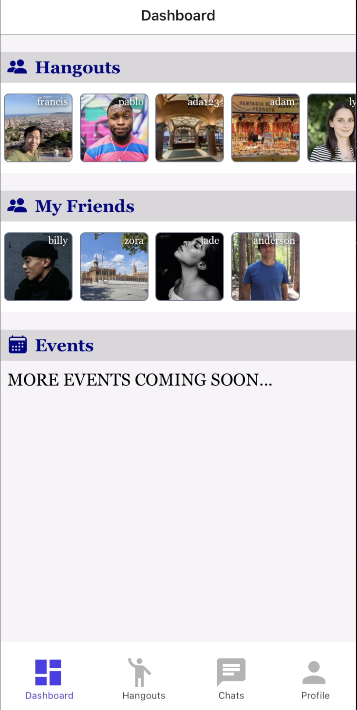
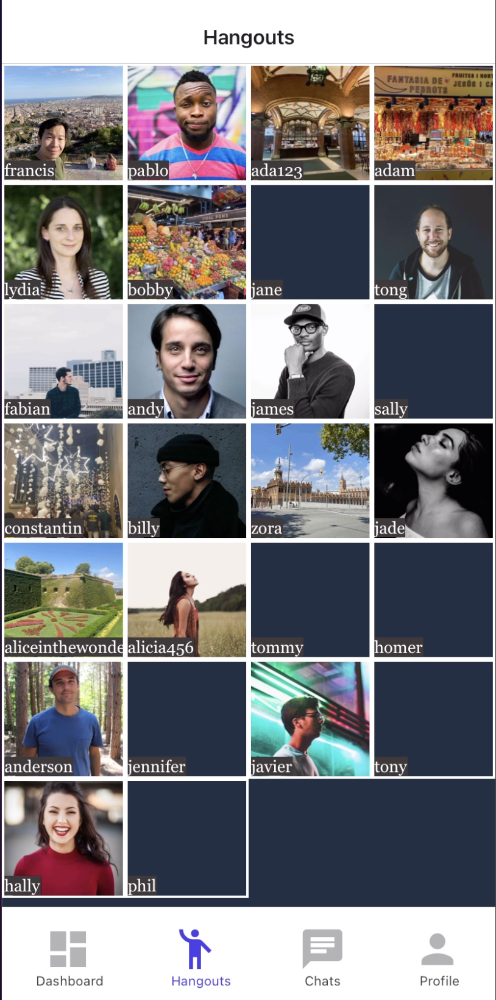
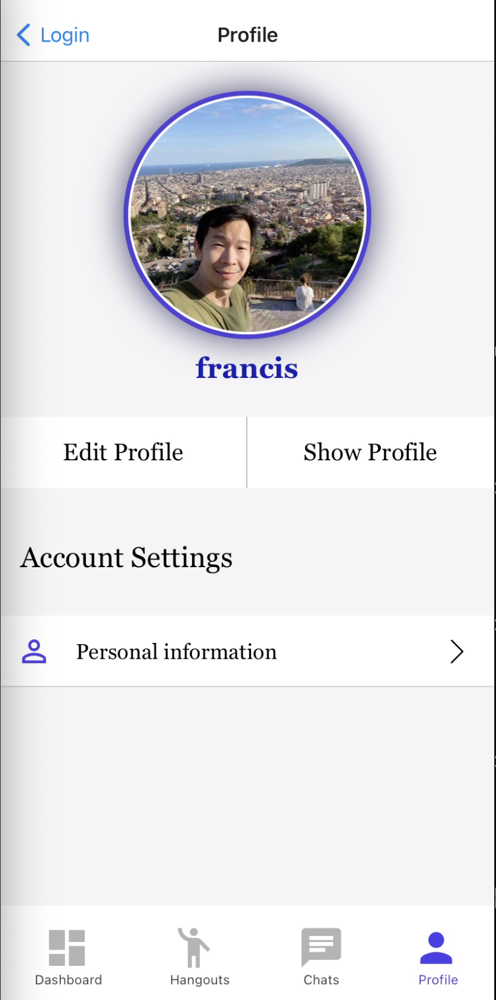

# REMOTEERS

## Introduction
Remote working has become a major phenomenon post-Covid lockdown as more jobs have become remote-enabled. Remoteers is a mobile app that connects remote workers, allowing remoteers to interact with each other through chatting and organizing events. 

## Screens

***Dashboard Screen***

***Hangouts Screen***

***Hangout User Details Screen***

***Chats Screen***

***Profile Screen***

***Profile Preview Screen***

## Tech Stacks
The app is built using 
* React native/ Expo (iOS) - mobile frontend framework
* NativeWind (TailwindCSS equivalent for mobile) - styling
* Formik - form validation
* Firebase - server, database & authentication
* Typescript

## Challenges Faced & Lessons Learnt

***React native & Expo***
  
  While react knowledge is mostly transferrable, there is still a considerable amount of mobile-specific knowledge and intricacies involved to be able to create a beautiful user interface and provide a smooth user experience. Below are some of the specifics:

  * packages - not all npm packages are compatible for mobile development - for example, react-native navigation package is different from react-router-dom.

  * The props which are passed through react-native-navigator will not re-render when the state changes. Therefore, to ensure that the UI is re-rendered whenever the state changes, we should managed the state via React Context API or using a state management library such as Redux
  
  * Differences in Styling and React elements - For example, ``Div`` element is known as ``View`` in React native; to allow for scrolling of a list of items, we have to use ``ScrollView`` and ``Flatlist`` elements. Also instead of using the standard TailwindCSS for styling, I have to use [NativeWind](https://www.nativewind.dev/), the mobile equivalent.
  
  * Certain CSS rules are not applicable or are applied differently - for example Flexbox, the default for web is flex-row but for mobile it is flex-column.

  * Performance - a crucial thing to understand about React native is that the framework helps to transpile Javascript to the underlying native code (Swift/Objective C for iOS and Kotlin/Java for Android), so for performance optimisation and to provide a better user experience, especially in dealing with gesture animation, we should use packages that are optimised for such transpilation. An example would be [React-native-reanimated](https://docs.swmansion.com/react-native-reanimated/)

***Handling asynchronous data posting and fetching***
  
  Users typically expect instant or near-instant update of interface after an interaction, such as login or updating profile. The challenge is ensuring that the state management can accommodate such user expectation as much as possible to ensure a smooth user experience, while at the same time dealing with the asynchronous aspects of data posting and fetching on the server and database side. 
  * For example, updating of user information can be performed after user information context has been updated to reduce loading time
  * Where necessary, a loading interface will be required to be served as a placeholder to the user while waiting for operations to be completed

***Structuring of React components to allow for reusability***
  
  * It is important to ensure that components props interface are well-defined to allow a component to be shared by other components or screens. This is where ``Typescript`` can be really useful

***Structuring of Entities data***
  
  * Again ``Typescript`` data typing shines when it comes to defining the data structures and entity interfaces

## Useful packages

***[React-native-reanimated](https://docs.swmansion.com/react-native-reanimated/)***

***[Expo-vector-icons](https://icons.expo.fyi/)***

***[Gorhom-React-Native-BottomSheet](https://github.com/gorhom/react-native-bottom-sheet)***

***[Expo-Location](https://docs.expo.dev/versions/latest/sdk/location/)***

***[Expo-Native-Picker](https://docs.expo.dev/versions/latest/sdk/picker/)***

